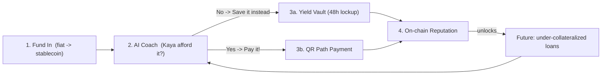
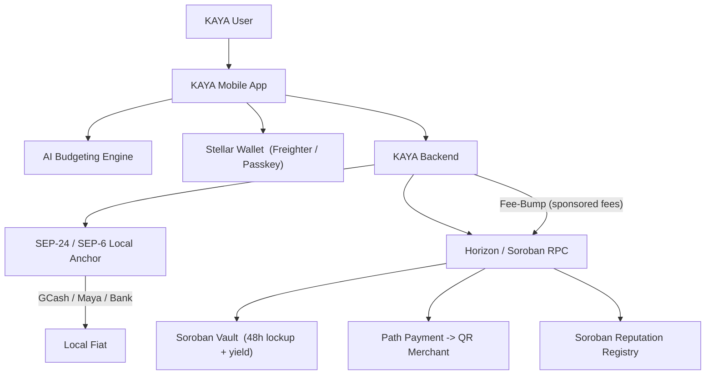

# KAYA — *"Kaya mo 'to."*

### An AI budgeting copilot that turns impulse spending into on-chain savings, gasless payments, and real financial credibility — built on Stellar.

> **One-liner:** KAYA is a mobile-first AI money coach for Filipino students and young professionals that doesn't just *track* spending — it *intervenes* at the moment of temptation, redirecting impulse purchases into a yield-earning Stellar savings vault, enabling instant local QR payments, and building an on-chain financial reputation users can borrow against.

**Submitted to:** APEC x Stellar Hackathon (SEA) — May 14 to late July 2026
**Tracks targeted:** Practical Payments · Meaningful DeFi · Localized Financial Tools · Composability
**Team:** KAYA
- Christian Gabrielle Mariveles — Team Lead
- Hannah Munoz — Smart Contracts / Product
- Adrian Joseph Salim — Backend / Frontend / AI / Stellar Integration
- Aldrhey Jave M. Agsunod — Backend / Frontend / AI / Stellar Integration

---

## Criteria Coverage at a Glance

Every qualifying requirement from the brief, mapped to where KAYA delivers it:

| Hackathon requirement | How KAYA meets it | Where |
|---|---|---|
| **User-facing financial app for real people** | Mobile money coach for Filipino students & young professionals | §1–§3 |
| **Practical payment app (everyday use)** | AI-approved QRPh payments, gasless via fee-bump | Feature 3 (§4) |
| **Meaningful DeFi using real assets** | Soroban yield vault on a local stablecoin w/ 48h cooling-off lockup | Feature 1 (§4) |
| **Localized financial tool / local economy** | GCash/Maya/bank ramps + PHP/SEA stablecoin as unit of account | Feature 2 (§4), §6 |
| **Integrate with local anchors** | SEP-24/SEP-6 against SEA Stellar anchors | Feature 2 (§4) |
| **Use local assets** | PHP/SEA stablecoin throughout the money loop | §3, §6 |
| **Give assets utility (earn/swap/disburse)** | Earn (vault yield), swap (path payments/AMM), disburse (QR pay, cash-out) | Features 1–3 (§4) |
| **Composability — reuse ecosystem building blocks** | Anchors, yield pools, DEX/AMM, fee-bump, wallets, attestations | §7 |
| → On/Off-ramps | SEP-24/SEP-6 anchor flows | Feature 2 |
| → DeFi & liquidity | Yield aggregator/pool + Stellar DEX/AMM | Features 1 & 3 |
| → Payments & disbursements | Path payments + fee-bump | Feature 3 |
| → Wallets & identity | Freighter/passkey + on-chain reputation score | Feature 4, §6 |

---

## 1. The Problem (and why it's local)

Young Filipinos are entering the digital economy faster than any generation before them — but the financial tools around them are built for tracking, not for *behavior change*, and almost none connect to real, productive assets.

- **Impulse spending is the default.** Students and fresh-grad professionals live transaction-to-transaction. E-wallets (GCash, Maya) make spending frictionless, but make *saving* an afterthought. A ₱250 coffee, a ₱600 food-delivery splurge, a ₱1,200 impulse buy — repeated weekly — is the difference between a savings buffer and none.
- **No emergency buffer.** A large share of young Filipinos have effectively zero liquid savings. One emergency = high-interest debt or borrowing from family.
- **Thin credit files.** Banks and lenders have almost no data on a 22-year-old's spending discipline. Good financial behavior is invisible and *unrewarded*, so responsible young people still get rejected or charged predatory rates.
- **Savings products are passive.** Even when people do save, the money sits in a wallet earning nothing.

**The gap:** there's no tool that closes the loop between *behavior* (coaching at the moment of decision), *productive assets* (yield on what you don't spend), *payments* (spend what you've saved seamlessly), and *credibility* (turning discipline into borrowing power).

KAYA closes that loop, and Stellar is the rail that makes it possible — cheap, fast, stablecoin-native, anchor-connected to local fiat, and composable with the DeFi and identity primitives we need.

---

## 2. Who it's for

| Persona | Situation | What KAYA gives them |
|---|---|---|
| **"Iskolar" — the student (18–24)** | Allowance-based, tempted by food delivery & online sales, zero savings | A coach that says "save it instead," and turns ₱250 saved coffees into a growing, yield-earning balance |
| **"Yuppie" — the young professional (23–30)** | First real income, lifestyle creep, wants to save but lacks discipline & buffer | Automated cooling-off savings, gasless local payments, and a credit reputation for future loans |
| **"Negosyante" — the micro-merchant (peer side)** | Accepts QR payments (QRPh), wants instant settlement | Receives the asset they want via Stellar path payments when a KAYA user pays |

Primary market: **Philippines**, designed to extend across **SEA** (same patterns in Indonesia, Vietnam, etc.) by swapping in local anchors and stablecoins.

---

## 3. The Solution — the KAYA "Money Loop"

KAYA is one continuous behavioral-financial loop, and every stage is powered by an existing Stellar building block (composability first):

1. **Fund in** — user deposits local fiat (GCash/Maya/bank) via a Stellar **anchor** and receives a local **stablecoin** in their KAYA wallet. *(On/Off-Ramps)*
2. **AI coaches** every meaningful purchase: *"Kaya mo ba 'to?"* (Can you afford this?). *(AI + behavioral layer)*
3. The decision branches:
   - **No → "Save it Instead"** routes the money into a **Soroban yield vault** with a cooling-off lockup. *(Meaningful DeFi)*
   - **Yes → "Pay It!"** executes an instant **QR path payment** to the merchant, gaslessly. *(Practical Payments)*
4. Every disciplined action updates the user's **on-chain Financial Health Score**, a reputation primitive other protocols can read to extend credit. *(Identity & Credibility)*

---

## 4. Feature Deep-Dives

### Feature 1 — The "Delayed Gratification" Vault *(Meaningful DeFi)*

**User story:** Maya wants a ₱250 iced latte. She opens KAYA to check. The AI flags it: she's already over her "wants" budget this week. Instead of a guilt-trip, KAYA shows a **"Save it Instead"** button. One tap moves ₱250 into her vault. She earns micro-yield, and the contract won't let her pull it back out for 48 hours — long enough for the craving to pass.

**How it works on Stellar:**
- A **Soroban smart contract** ("KAYA Vault") that accepts deposits of a local **stablecoin** (PHP-pegged or generic SEA stablecoin).
- On deposit, idle funds are routed into an **existing Stellar yield aggregator / liquidity pool** (composability — we don't build a yield engine; we plug into one). Fiat→stablecoin conversion happens via the local anchor at fund-in time.
- **The twist — a "Cooling-Off Lockup":** the contract enforces a per-deposit **48-hour withdrawal lock**. This is the behavioral innovation — DeFi mechanics used to *break the impulse-spending cycle*, not just to farm yield.

**Why it judges well:** it's DeFi with a genuine, human purpose tied to a real asset and a real local problem — not yield for yield's sake. The lockup is a memorable, defensible product insight.

**Composability note:** Soroban contract + third-party yield pool + anchor-issued stablecoin = three existing primitives stitched into one behavior-changing feature.

---

### Feature 2 — Native "KAYA Wallet" Funding & Cash-Out *(On/Off-Ramps)*

**User story:** Carlo links his GCash, taps "Add ₱1,000," confirms in the familiar GCash flow, and seconds later sees ₱1,000 of spendable balance in KAYA. When he wants out, "Cash Out" returns pesos to his bank/e-wallet.

**How it works on Stellar:**
- **SEP-24 (Hosted Deposit & Withdrawal)** for the interactive flow and **SEP-6 (Programmatic Deposit & Withdrawal)** for the streamlined path, integrated against **existing Southeast Asian Stellar anchors**.
- User deposits local fiat through familiar rails (**GCash, Maya, local bank transfer**) → anchor issues the corresponding **local stablecoin** straight into the KAYA wallet.
- Supporting SEPs: **SEP-10** (wallet authentication) and **SEP-12** (KYC handoff to the anchor, so KAYA never custodies identity docs).

**Why it judges well:** it's the clearest possible demonstration of *"build on existing ecosystem rails rather than your own payment gateway."* We explicitly consume anchor infrastructure.

**Composability note:** zero payment-gateway code — KAYA is a thin, friendly client over standardized anchor SEPs.

> **Honest note for judges:** a fully public, production PH fiat anchor with open SEP access is still maturing. For the hackathon build we integrate against the **Stellar Anchor reference implementation / testnet anchor (SEP-24/6 compliant)**, with the UX wired exactly as it will be for live GCash/Maya/bank anchors at launch.

---

### Feature 3 — "Kaya Afford It? Pay It!" QR Payments *(Practical Payments)*

**User story:** The AI gives Maya the green light on her groceries — *"Kaya mo 'to!"* A **"Pay Now"** button appears. She scans the store's **QRPh** code, and the exact amount is paid. She never thinks about crypto, gas, or conversion — she just paid in pesos.

**How it works on Stellar:**
- A **QR scanner** compatible with local standards (**QRPh / regional EMVCo**).
- On scan, KAYA builds a **Stellar path payment** that converts the user's **stablecoin savings** into the asset the merchant requires — atomic conversion + settlement in one transaction (composing with Stellar's built-in **DEX / AMM** liquidity).
- **Developer UX hack — Fee-Bump (Sponsored Fees):** KAYA's backend wraps the user's transaction in a **fee-bump transaction** and pays the microscopic XLM network fee. To the user, the app is **completely gasless** — they only ever see and spend local currency.

**Why it judges well:** this is *practical* payments — a real purchase, at a real merchant, using a real local QR standard, with a UX indistinguishable from GCash. Path payments + fee-bump show real Stellar fluency.

**Composability note:** uses Stellar's native DEX/AMM for conversion and the built-in fee-bump primitive for gasless UX — no custom matching engine, no custom relayer.

---

### Feature 4 — On-Chain Financial Health Score *(Identity & Credibility)*

**User story:** After three months of hitting savings goals and respecting cooling-off periods, Carlo has a verifiable **KAYA Score**. When a Stellar micro-lending protocol later offers him a low-collateral loan, it's because it could *read his proven track record on-chain*.

**How it works on Stellar:**
- As users follow KAYA's advice, hit savings goals, and complete cooling-off periods, those achievements are recorded as **on-chain attestations** / entries in a **Soroban-based reputation registry**.
- The score is a **composable Web3 primitive**: a public, user-controlled, portable signal of financial discipline.

**Real-world utility:** other Stellar-based **micro-lending protocols** can read the KAYA Score to grant **under-collateralized loans** to young professionals who've *proven* good habits — turning invisible discipline into real borrowing power and tackling the thin-credit-file problem head-on.

**Why it judges well:** it extends a simple "financial health score" into durable, ecosystem-wide utility — exactly the kind of new capability composability is meant to unlock.

**Composability note:** the score is designed to be *consumed by others*, making KAYA a building block in the wider Stellar credit stack, not a walled garden.

---

## 5. Architecture

---

## 6. Stellar Tech Stack

| Layer | Technology / Standard | Used for |
|---|---|---|
| Smart contracts | **Soroban** | Yield vault w/ cooling-off lockup; reputation registry |
| Network access | **Horizon + Soroban RPC** | Submitting tx, reading state |
| Payments | **Path Payments** | QR purchase: stablecoin -> merchant asset |
| UX / fees | **Fee-Bump (sponsored fees)** | Gasless experience for users |
| Liquidity | **Stellar DEX / AMM + yield pool** | Conversion + vault yield (composed, not built) |
| On/off-ramp | **SEP-24, SEP-6** | Fiat deposit/withdraw via local anchors |
| Auth / KYC | **SEP-10, SEP-12** | Wallet auth + anchor-side KYC |
| Asset | **Local PHP / SEA stablecoin** | Unit of account throughout |
| Wallet | **Freighter / Passkey (smart-wallet)** | Low-friction key management |

App layer: mobile-first client (**React Native / Flutter** — TBD), KAYA backend orchestrating AI + Stellar SDK + fee-bump service.

---

## 7. Composability — what we reuse vs. build

**We build (thin, opinionated):** the AI coaching layer, the cooling-off vault contract logic, the reputation registry schema, and the consumer UX that makes all of it feel like a normal peso wallet.

**We reuse (the heavy lifting):**
- **On/off-ramps:** existing SEA Stellar **anchors** (SEP-24/6).
- **DeFi & liquidity:** existing **yield aggregator / liquidity pools** and Stellar's native **DEX/AMM**.
- **Payments & disbursements:** Stellar **path payments** + **fee-bump**.
- **Wallets & identity:** **Freighter / passkey** wallets + **on-chain attestations**.

This is the hackathon's stated principle in action — *plug into existing wallets, DeFi protocols, and on/off-ramps; don't reinvent the wheel.*

---

## 8. Roadmap (aligned to program timeline)

| Phase | Window | Milestones |
|---|---|---|
| **Foundations** | May 14 – early Jun 2026 | Wallet + testnet account; issue/define local stablecoin; SEP-24 deposit demo |
| **Core DeFi + Payments** | Jun 2026 | Soroban vault w/ 48h lockup + yield pool integration; QR path-payment + fee-bump (gasless) |
| **AI + Reputation** | Early – mid Jul 2026 | AI "Kaya afford it?" coaching; Soroban reputation registry + score |
| **Polish + Pitch** | Late Jul 2026 | End-to-end demo, judging submission |
| **Post-hackathon** | Aug – Sep 2026 | Anchor partnership conversations, pilot users, micro-lending protocol integration |

---

## 9. Risks & Honest Gaps

- **PH anchor availability:** production PH fiat anchors are still maturing → demo uses the **testnet/reference anchor**, UX built to swap in live anchors at launch.
- **Yield source maturity on Stellar:** we integrate the most established available pool/aggregator; the vault is designed so the yield backend is swappable.
- **Regulatory (e-money / lending):** KYC is delegated to licensed anchors (SEP-12); under-collateralized lending is positioned as a *future, partner-provided* layer that reads our score, not something KAYA underwrites itself.
- **Behavioral assumptions:** the 48h lockup is grounded in delayed-gratification research; we'll validate cooling-off length with pilot users.

---

## 10. Impact, KPIs & The Ask

**Impact:** KAYA converts everyday impulse spending into savings, yield, and creditworthiness for the most underserved-by-design segment — young Filipinos — using rails that already exist in the Stellar ecosystem.

**KPIs we'll track:**
- ₱ redirected from impulse spend into the vault per user / month
- % of cooling-off periods that end in *keeping* the savings (vs. withdrawing)
- Active QR payments settled via path payment
- KAYA Scores generated; loan offers unlocked through partner protocols

**The ask:** technical mentorship from the Stellar ecosystem (Soroban + anchors), introductions to **SEA anchor partners** and **yield/lending protocols** for composability, and the chance to compete for the prize pool to fund a pilot.

---

## Appendix A — Demo Script (90 seconds)

1. **Fund in:** "Add ₱1,000" → GCash-style flow (testnet anchor) → balance appears in KAYA.
2. **Get coached:** Try to buy a ₱250 coffee → AI: *"Hindi pa kaya this week."* → tap **Save it Instead** → ₱250 enters the vault, 48h lock + live micro-yield shown.
3. **Approved purchase:** Scan a grocery **QRPh** code → AI: *"Kaya mo 'to!"* → **Pay Now** → path payment settles, **no gas shown** (fee-bumped).
4. **Reputation:** Open profile → **KAYA Score** ticked up from the disciplined choice → note: *"a lending protocol can read this on-chain."*

## Appendix B — Glossary

- **Anchor:** a Stellar on/off-ramp that issues fiat-backed tokens and handles deposits/withdrawals (via SEPs).
- **SEP:** Stellar Ecosystem Proposal — standard interfaces (SEP-24/6 ramps, SEP-10 auth, SEP-12 KYC).
- **Soroban:** Stellar's smart-contract platform.
- **Path payment:** a Stellar payment that converts one asset to another atomically using DEX/AMM liquidity.
- **Fee-bump:** a transaction wrapper letting one account pay another's network fee → gasless UX.
- **Attestation / reputation registry:** on-chain records of verified user achievements, readable by other protocols.
